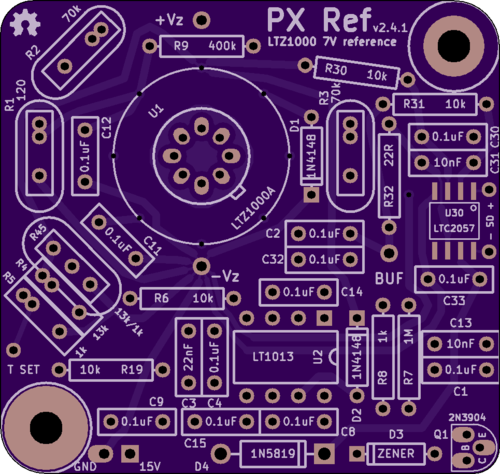

# PX Ref

This is an LTZ1000-based 7V reference.

Specifically, this is my board layout of a circuit [published](http://www.eevblog.com/forum/metrology/ultra-precision-reference-ltz1000/msg249123/#msg249123) by Andreas (of the EEVBlog forum), which in turn is a modification of the 7V reference circuit from the [datasheet](http://cds.linear.com/docs/en/datasheet/1000afe.pdf).

## Latest revision

- [v2.4.1](kicad/releases/v2.4.1)

## Revision history:

- [v2.4.1](kicad/releases/v2.4.1)
  - Used larger pads on the TO-99 footprint (easier to solder).
  - Moved the input and (buffered) output caps directly onto the board. 
- [v2.4](kicad/releases/v2.4)
  - The board is slightly smaller and fits within a [TEKO 371.16](http://www.tekoenclosures.com/en/products/family/RF/series/37-39) enclosure.
  - The chassis-ground jumper has been removed (these can now be linked with a small wire).
  - The center pin of the R4/R5 divider has been exposed ("T SET") for off-board manipulation.
  - The LTC2057 shutdown pins have been exposed for off-board control.
- [v2.3](kicad/releases/v2.3)
  - The "b" variant has been merged back into a single board design (R4, R5 and R45 are now all on the same board design).
  - The LTC2057 shutdown pins are now left floating.
- [v2.2](kicad/releases/v2.2), [v2.2b](kicad/releases/v2.2b)
  - 2.2 uses a single divider footprint (called R45) for R4 and R5.
  - 2.2b uses separate footprints for R4 and R5.
  - An output buffer was added (LTC2057).
  - **Errata:**
    - A mistake was made with the LTC2057 shutdown pins which will result in self-heating of a few degrees in the LTC2057.  The work-around is to disconnect pins 1 and 8 of the LTC2057. 
- [v2.1](kicad/releases/v2.1)
  - Added a jumper to optionally link GND to a chassis standoff.
  - Used smaller capacitor footprints.
  - Exposed the star ground as a solderable terminal.
  - Switched D1 from a 1N4001 to a 1N4148.
  - Used smaller footprints for D1 and D2.
  - **Errata:**
    - Andreas capacitor C15 was accidentally left off of this board design.  This cap isn't critical, but a work-around is to bodge a 0.1uF cap across pins 5-6 of the LT1013.
- [v2](kicad/releases/v2)
  - Switched to a simpler, 2-layer, 50mm x 50mm board design.
- [v1](kicad/releases/v1)
  - First design.  4-layer with via stitching for a mild EMI shielding effect.
  - This board was never ordered and tested.

## Schematic

Andreas' original schematic: [png](media/LTZ1KA_1b.PNG)

My adapted version of Andreas' schematic: [pdf](kicad/releases/v2.4.1/basic-ltz1000.pdf)

## Purchasing

You can order a copy of this board from OSHPark: [link](https://oshpark.com/shared_projects/hUZKe65r)

## Discussion

My posts to the EEVBlog forum about this design: [link](http://www.eevblog.com/forum/metrology/ultra-precision-reference-ltz1000/msg1375209/#msg1375209) [link](http://www.eevblog.com/forum/metrology/px-reference/)

The naming of this board was inspired by other LTZ1000 references: [KX](https://xdevs.com/article/kx-ref/), [FX](https://xdevs.com/article/792x/), [MX](https://www.eevblog.com/forum/metrology/mx-reference/), [CX](https://www.eevblog.com/forum/metrology/cx-reference/), [QX](http://www.eevblog.com/forum/metrology/ultra-precision-reference-ltz1000/msg1377719/#msg1377719)

See also:
- https://github.com/pepaslabs/dr-frank-ltz1000
- https://github.com/pepaslabs/hp-03458-66509-clone
