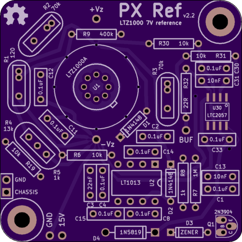
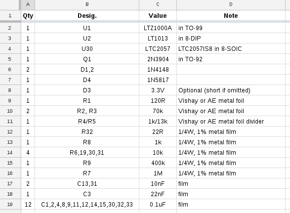

# PX Ref v2.2

## Bill of materials (BOM)

Spreadsheet: [link](https://docs.google.com/spreadsheets/d/1iMRS2HY1jZ_TCvgPMmdHyxduSDgiw9QMjbdRjiF5_4c/edit?usp=sharing)

## Parts from the datasheet schematic:

### U1

LTZ1000 or LTZ1000A.

### U2

LT1013 in DIP8.

### Q1

2N3904 in TO-92.

### R1, R2, R3, R4 / R5

These are the "critical" resistors.

R1 sets the current through the zener.
The ratio of R4 to R5 sets the temperature set-point of the heater circuit.

These footprints are intended for Vishay or AE metal foil resistors.  R4 / R5 is for a Vishay "voltage divider" resistor set.

### R6, R7, R8, R9

Nothing fancy here, just 1% metal film 1/4 Watt resistors.  The reference board in HP's 3458A has them spec'ed as being 100ppm/C.

- R6: 10k
- R7: 1M
- R8: 1k

R9 is optional and is used to tune the temperature coefficient of the circuit.  The datasheet recommends using it with the LTZ1000 and omitting it with the LTZ1000A.  Try experimenting with this value in either case.

- R9: 400k

### C1, C2, C3

I chose to use film capacitors here to avoid the microphonic sensitivity of ceramic capacitors.

- C1, C2: 0.1uF

The datasheet specifies 2nF for C3, but most circuits I've seen use 22nF.  A forum member claims using 2nF causes the control loop to be a bit "ringy".  In fact, the negative version of the circuit in the datasheet specifies 22nF, so I'm curious if 2nF for the 7V schematic was a typo.

- C3: 22nF

### D1, D2

1N4148.

## Parts from Andreas' schematic:

### C8, C11, C12, C13, C14, C15

Andreas has added these capacitors for stability and EMI suppression.

- C13: 10nF
- C8, C11, C12, C14, C15: 0.1uF

### C9

0.1uF, the output capacitor.  Solder this to the output binding posts.

## Parts I've added:

Schematic: [pdf](basic-ltz1000.pdf)

### C4

0.1uF, for the LT1013 supply.

### D4

This diode is for reverse polarity protection on the 15V supply.

I chose to go with a 1 amp Shottky diode (1N5817, 1N1518, or 1N1519)
because it has a lower voltage drop than a regular 1 amp diode (1N4001, etc),
but nearly any diode will work here.
A lower voltage drop would be desireable when running the board from a 12V lead acid battery.

Results of testing voltage drop at 20mA of a few diodes I had on hand:
- 1N5817: 0.23V
- 1N5819: 0.29V
- 1N4001: 0.71V
- 1N4006: 0.73V
- 1N4148: 0.78V

## D3

This is a zener diode which was suggested by a forum member.  It's effect would be to limit the initial in-rush current to a cold LTZ1000 heater.

Monitoring the emitter of the 2N3904 on startup with the board driven from a 15V supply (populated with an LTZ1000A) showed that the emitter voltage was at about 6.3V at ~1 second, slowly falling to about 5.26V after a few minutes.  This was with an uncovered LTZ1000A at 73F ambient.

So, what's a good value for D3?  If we consider the minimum supply voltage for this board to be 11.6V (a nearly discharged 12V lead acid battery), and we allow 7V for the heater at start-up, and 0.7V drop across the 2N3904, that leaves us with (11.6 - 7 - 0.7) = 3.9V.

Testing with an LTZ1000A showed that the entire board stabilized to about 22mA of current consumption after a few seconds, with the voltage past D4 being about 14.78V.

### Mounting holes

These holes are intended to accomodate M3 brass hex standoffs.

Ideally, only one mounting hole should be secured with a nut.
The other should "float", allowing the board to expand and contract freely with temperature
(bending the baord can put stress on the components, causing tiny shifts in output voltage).

## Ouput buffer:

### U30

LTC2057 in SOIC-8.

### R30, R31, R32

1% metal film.

- R30, R31: 10k
- R32: 22R

### C30, C31, C32, C33

More film caps.

- C31: 10nF
- C30, C32, C33: 0.1uF

C32 is the (buffered) output capacitor.  Solder it to the binding posts.

## TODO for next board revision

- Make the board slightly smaller in one dimension to fit within a [TEKO](http://www.tekoenclosures.com/en/products/family/RF/series/37-39) case?
