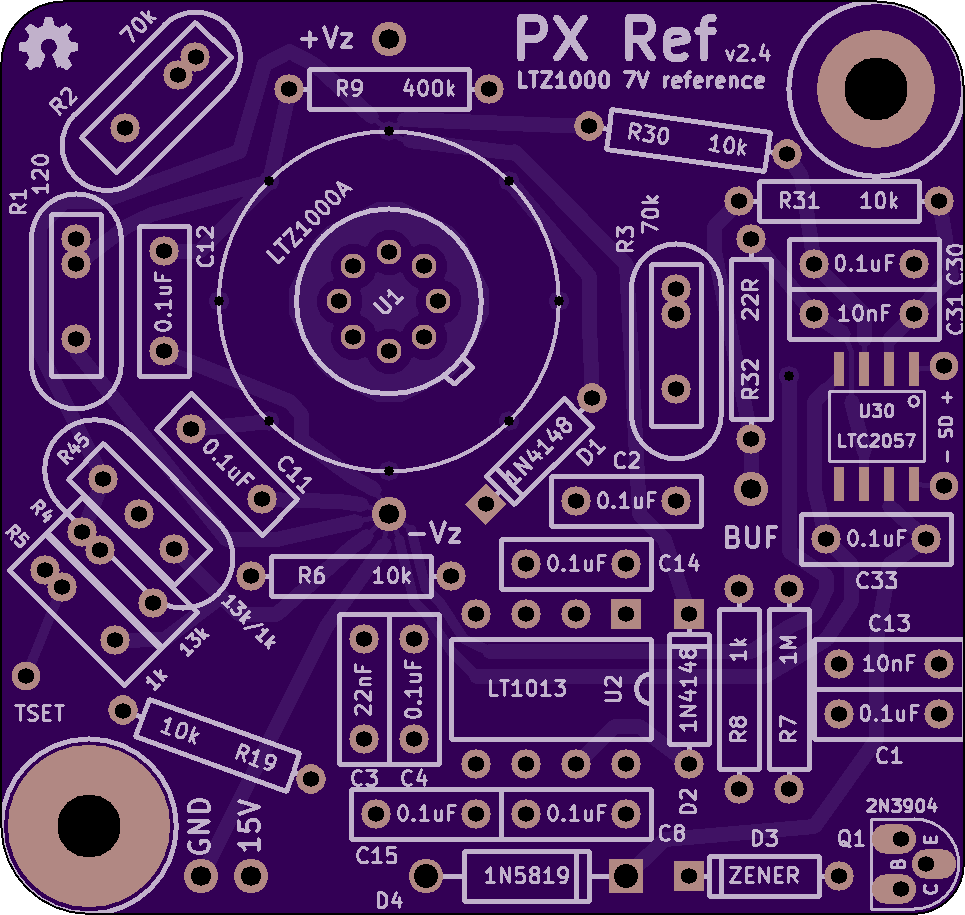
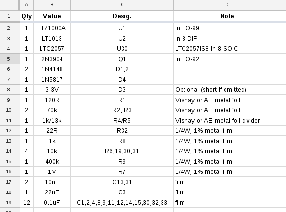
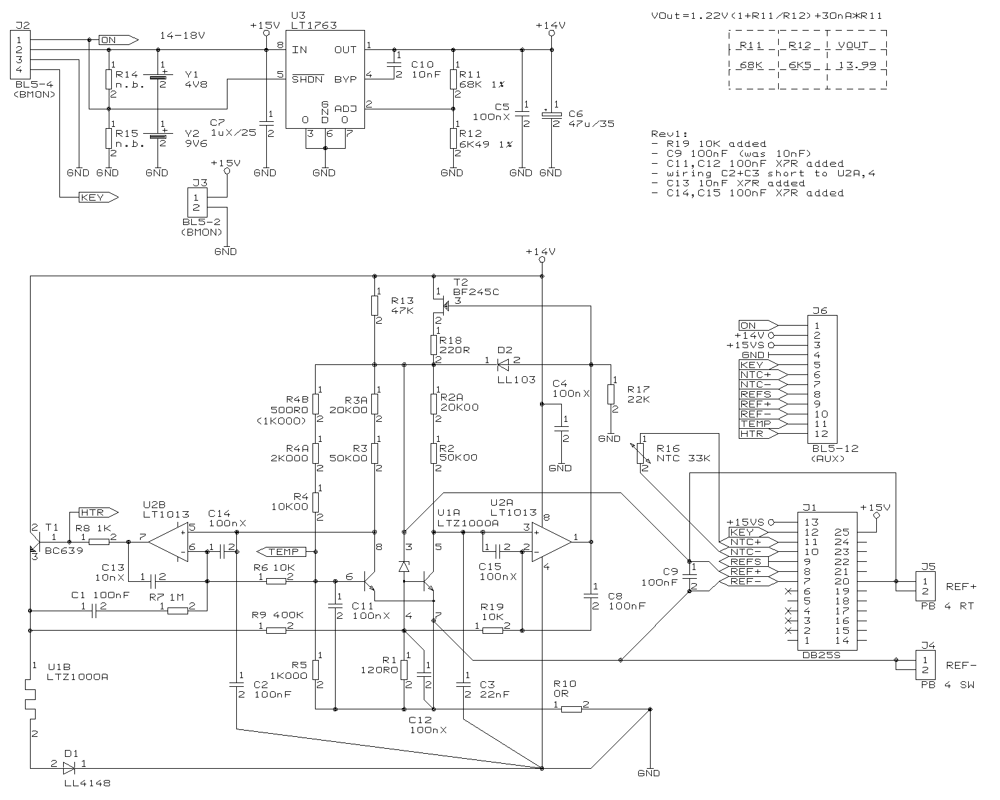
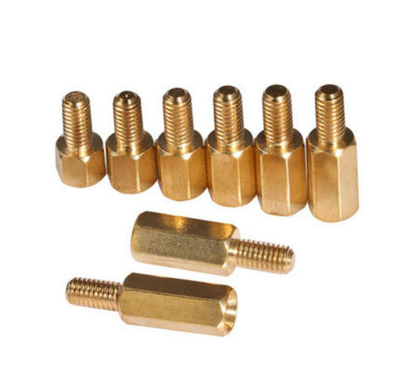

# PX Ref v2.4

## Bill of materials (BOM)

Spreadsheet: [link](https://docs.google.com/spreadsheets/d/1Y3n63W4g9fGwFwLfaXiGHgZg_IhSQoVIadUeNRAaL08/edit?usp=sharing)

## Parts from the datasheet schematic:

### U1

LTZ1000 or LTZ1000A.

### U2

LT1013 in DIP8.

### Q1

2N3904 in TO-92.

### R1, R2, R3, R4 / R5, R45

These are the "critical" resistors.

These footprints are intended for Vishay or AE metal foil resistors, in either the hermetic "metal can" package, or the "box" epoxy package.

R45 is for a Vishay "voltage divider" resistor set.  R4 and R5 are discrete footprints for the same divider.  Populate either R45 or R4 and R5.

R1 sets the current through the zener.

The ratio of R4 to R5 sets the temperature set-point of the heater circuit.
The 13:1 ratio is just the value given in the datasheet -- you can tweak this lower or higher to suit your needs.  I've used between 12.2:1 and 12.5:1 successfully.
If the ratio is too low, the LTZ will fall out of thermal regulation (you'll know that this happens because the temperature coefficient will be 50ppm/C).
Increasing the ratio allows for operation in a higher-temperature ambient environment (HP uses a 15:1 ratio in their 3458A), but will increase the ageing rate of the LTZ1000.

Note that the common terminal between R4 and R5 has been brough out via the "TSET" pin.  This can be used to alter the temperature set-point, e.g. for implementing an (off-board) "[Pickering patent](https://patents.google.com/patent/US5369245)" hystersis treatment.

#### Relative impact of R1 - R5

Several members of the EEVBlog forums have emperically measured the impact of drift in these resistors.  I have summarized their results here: [link](https://www.eevblog.com/forum/metrology/resistor-set-for-ltz1000-positive-standard-7v-circuit/msg1386014/#msg1386014)

Some obvervations, just to check your understanding:

The drift of R3 is only 6% as important as the drift of the R4/R5 ratio.  That is, if R4/R5 drifted by 1ppm, R3 would have to drift by over 16ppm to have the same impact on the reference ouput.

The temperature coefficient of one of the 70k resistors (R2) is six times more important than the other 70k resistor (R3).

The R4/R5 ratio is about 3x more important than R2, about 7x more important than R1, and about 16x more important than R3.

### R6, R7, R8, R9

Nothing fancy here, just 1% metal film 1/4 Watt resistors.  The reference board in HP's 3458A has them spec'ed as being 100ppm/C.

- R6: 10k
- R7: 1M
- R8: 1k

R9 is optional and is used to tune the temperature coefficient of the circuit.  The datasheet recommends using it with the LTZ1000 and omitting it with the LTZ1000A.  Try experimenting with this value in either case.

- R9: 400k

### C1, C2, C3

I chose to use film capacitors here to avoid the microphonic sensitivity of ceramic capacitors.

- C1, C2: 0.1uF

The datasheet specifies 2nF for C3, but most circuits I've seen use 22nF.  A forum member claims using 2nF causes the control loop to be a bit "ringy".  In fact, the negative version of the circuit in the datasheet specifies 22nF, so I'm curious if 2nF for the 7V schematic was a typo.

- C3: 22nF

### D1, D2

1N4148.

## Parts from Andreas' schematic:

### C8, C11, C12, C13, C14, C15

Andreas has added these capacitors for stability and EMI suppression.

- C13: 10nF
- C8, C11, C12, C14, C15: 0.1uF

### C9

0.1uF, the output capacitor.  Solder this to the output binding posts.

## Parts I've added:

Schematic: [pdf](basic-ltz1000.pdf)

### C4

0.1uF, for the LT1013 supply.

### D4

This diode is for reverse polarity protection on the 15V supply.

I chose to go with a 1 amp Shottky diode (1N5817, 1N1518, or 1N1519)
because it has a lower voltage drop than a regular 1 amp diode (1N4001, etc),
but nearly any diode will work here.
A lower voltage drop would be desireable when running the board from a 12V lead acid battery.

Results of testing voltage drop at 20mA of a few diodes I had on hand:
- 1N5817: 0.23V
- 1N5819: 0.29V
- 1N4001: 0.71V
- 1N4006: 0.73V
- 1N4148: 0.78V

## D3

This is a zener diode which was suggested by a forum member,
which limits the initial in-rush current of a cold LTZ1000 heater.

Monitoring the emitter of the 2N3904 on startup with the board driven from a 15V supply (populated with an LTZ1000A) showed that the emitter voltage was at about 6.3V at ~1 second, slowly falling to about 5.26V after a few minutes.
This was with an uncovered LTZ1000A at 73F ambient.

So, what's a good value for D3?
If we consider the minimum supply voltage for this board to be 11.6V
(a nearly discharged 12V lead acid battery),
and we allow 7V for the heater at start-up,
0.7V drop across the 2N3904,
and 0.3V drop across the 1N5819,
that leaves us with (11.6 - 7 - 0.7 - 0.3) = 3.6V.

So, a 3.3V zener would be a conservative choice here.

### Mounting holes

These holes are intended to accomodate M3 brass hex standoffs.

Ideally, only one mounting hole should be secured with a nut.
The other should "float", allowing the board to expand and contract freely with temperature
(bending the baord can put stress on the components, causing tiny shifts in output voltage).

Note that the copper pad of one of the mounting holes has been enlarged.  This is to facilitate soldering a connection between chassis and ground (the ground pin is adjacent to this mounting hole).

## Ouput buffer:

### U30

LTC2057 in SOIC-8.

Note that the "shutdown" functionality has been brought out via the "-SD+" pins.  This might be useful if implementing an (off-board) output shutdown mechanism.  For example, I plan on implementing a mechanism where the output isn't enabled until the temperature of the board's oven has stabilized.

### R30, R31, R32

1% metal film.

- R30, R31: 10k
- R32: 22R

### C30, C31, C32, C33

More film caps.

- C31: 10nF
- C30, C32, C33: 0.1uF

C32 is the (buffered) output capacitor.  Solder it to the binding posts.

## Changes from previous board revision

- Board dimensions should now be small enough to squeeze into a TEKO 371.16 case (a steel case which can fit inside of a Hammong 1590B).  Such an arrangement should shield from both EMI as well as magnetic fields.
- The "shutdown" pins of the LTC2057 have been exposed via break-out pins (for implementing off-board control).
- The center terminal of the R4 / R5 divider has been exposed via a breakout pin (for off-board manipulation of the temperature set-point).
- The chassis-ground jumper has been removed (You can solder a wire from ground to the pad of the adjacent mounting hole if you want ground to be connected to chassis via brass stand-offs).
- Minor routing tweaks.

## Choosing Vsupply

Andreas of the EEVBlog forums has shown that the PSRR of this cicruit is essentially linear at least down to 9V.

https://www.eevblog.com/forum/metrology/ultra-precision-reference-ltz1000/msg842662/#msg842662

