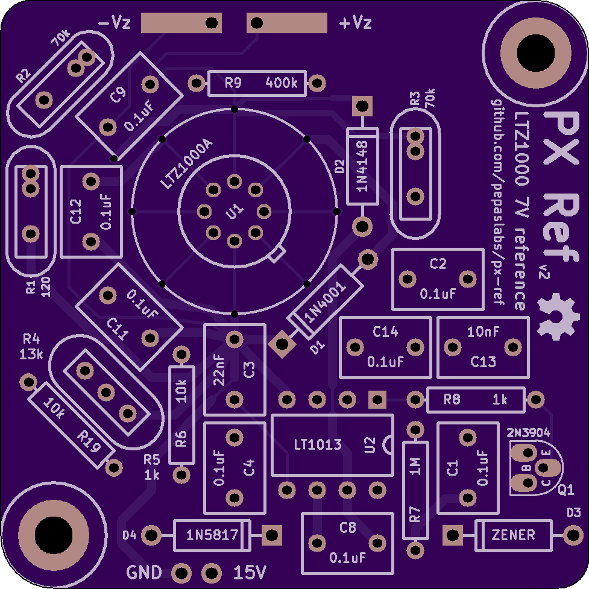
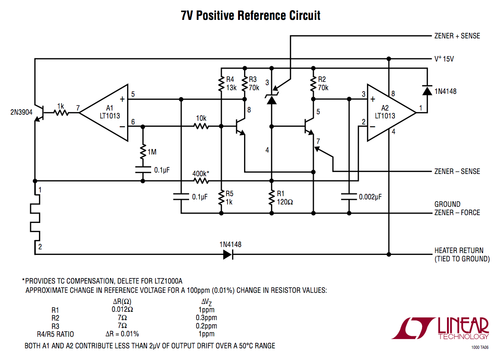

# PX Ref v1

Schematic: [pdf](basic-ltz1000.pdf)

# BOM (Bill of materials):

## Parts from the datasheet schematic:

### R1, R2, R3

These footprints are intended for Vishay or AE metal foil resistors.

### R4 / R5

This footprint is intended for a Vishay "voltage divider" resistor set.

### C1

### Mounting holes

These holes are intended to accomodate an M3 brass hex standoff.

Ideally, only one mounting hole should be secured with a nut.
The other should "float", allowing the board to expand and contract freely with temperature
(bending the baord can put stress on the components, causing tiny shifts in output voltage).

### D1, D2

### D4

This diode is for reverse polarity protection on the 15V supply.
I chose to go with a 1 amp Shottky diode (1N5817, 1N1518, or 1N1519)
because it has a lower voltage drop than a regular 1 amp diode (1N4001, etc),
but nearly any diode will work here.
A lower voltage drop would be desireable when running the board from a 12V lead acid battery.
