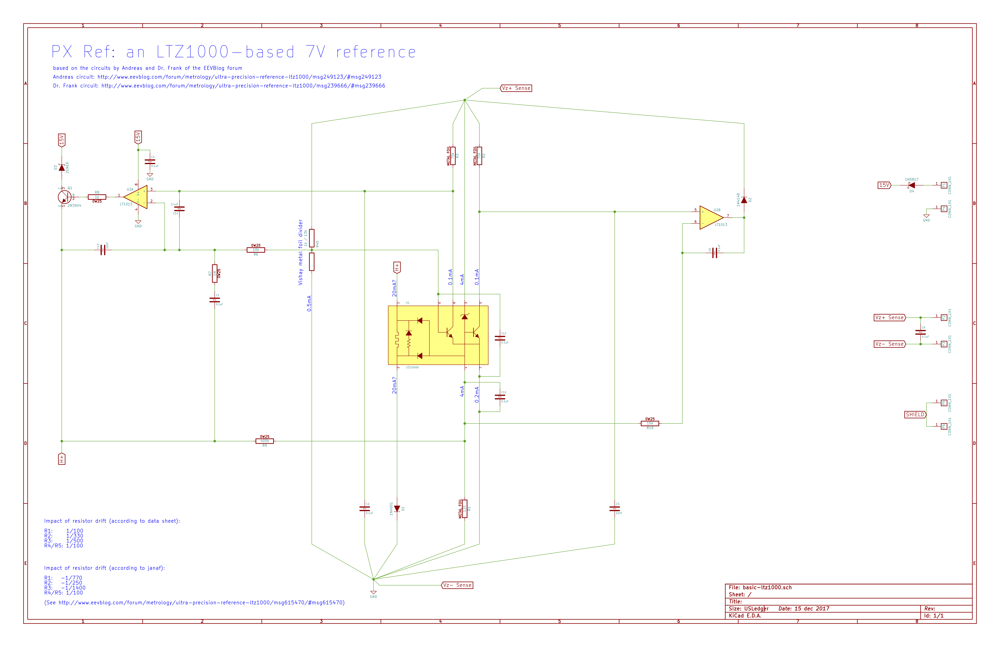
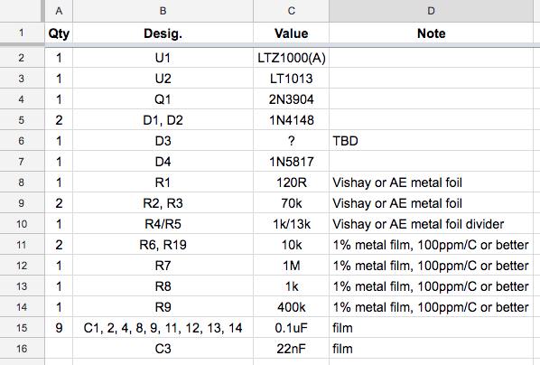

# PX Ref v1

Schematic: [pdf](basic-ltz1000.pdf)

## Parts from the datasheet schematic:

### U1

LTZ1000 or LTZ1000A.

### U2

LT1013 in DIP8.

### Q1

2N3904 in TO-92.

### R1, R2, R3, R4 / R5

These are the "critical" resistors.

R1 sets the current through the zener.
The ratio of R4 to R5 sets the temperature set-point of the heater circuit.

These footprints are intended for Vishay or AE metal foil resistors.  R4 / R5 is for a Vishay "voltage divider" resistor set.

### R6, R7, R8, R9

Nothing fancy here, just 1% metal film 1/4 Watt resistors.  The reference board in HP's 3458A has them spec'ed as being 100ppm/C.

- R6: 10k
- R7: 1M
- R8: 1k

R9 is optional and is used to tune the temperature coefficient of the circuit.  The datasheet recommends using it with the LTZ1000 and omitting it with the LTZ1000A.  Try experimenting with this value in either case.

- R9: 400k

### C1, C2, C3

I chose to use film capacitors here to avoid the microphonic sensitivity of ceramic capacitors.

- C1, C2: 0.1uF

The datasheet specifies 2nF for C3, but most circuits I've seen use 22nF.  A forum member claims using 2nF causes the control loop to be a bit "ringy".  In fact, the negative version of the circuit in the datasheet specifies 22nF, so I'm curious if 2nF for the 7V schematic was a typo.

- C3: 22nF

### D1, D2

The datasheet specifies 1N4148 here.  A forum member suggested using a 1N4001 for D1 to better handle the in-rush current of a cold unit, but the 1N4148 is spec'ed at 300mA continuous, so it should be fine.

## Parts from the Andreas' schematic:

FIXME

## Parts I've added:

### D4

This diode is for reverse polarity protection on the 15V supply.
I chose to go with a 1 amp Shottky diode (1N5817, 1N1518, or 1N1519)
because it has a lower voltage drop than a regular 1 amp diode (1N4001, etc),
but nearly any diode will work here.
A lower voltage drop would be desireable when running the board from a 12V lead acid battery.

### Mounting holes

These holes are intended to accomodate M3 brass hex standoffs.

Ideally, only one mounting hole should be secured with a nut.
The other should "float", allowing the board to expand and contract freely with temperature
(bending the baord can put stress on the components, causing tiny shifts in output voltage).

## Bill of materials (BOM)

Spreadsheet: [link](https://docs.google.com/spreadsheets/d/1iXBirF7wwRB60OcZYET5RVX0cuXblMtFNKk5hwqcZ_Y/edit?usp=sharing)
